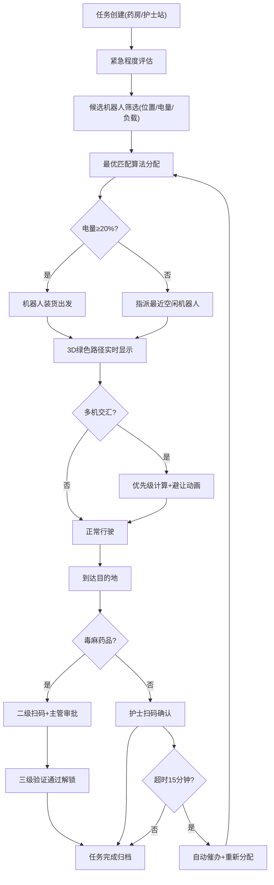

# 医院智能物流机器人调度与可追溯平台 - 产品需求文档

## 1. 产品概述
面向大型三甲医院的智能物流机器人统一调度与追溯管理平台，通过3D可视化场景实现药房、检验科、手术室、病区护士站、中心供应室五大核心区域的全覆盖，解决医院内部物资运输效率低、人工成本高、毒麻药品管控难、运输过程不可追溯等痛点问题。
- 核心价值：提升医院物流效率300%，降低人工运输成本60%，实现毒麻药品100%可追溯
- 目标用户：医院物流管理部门、药房管理员、病区护士长、设备维护工程师

## 2. 核心功能

### 2.1 用户角色
| 角色 | 登录方式 | 核心权限 |
|------|----------|----------|
| 系统管理员 | 工号+密码 | 全局配置、机器人管理、数据导出 |
| 药房管理员 | 工号+密码 | 发药任务创建、毒麻药品审批、扫码确认 |
| 病区护士 | 工号+密码 | 接收扫码、任务催办、异常上报 |
| 护士长/主管 | 工号+密码+人脸 | 毒麻药品二级审批、运输记录审核 |
| 维修工程师 | 工号+密码 | 故障工单接收、维修记录上传、机器人状态查询 |

### 2.2 功能模块
1. **3D场景总览**: 医院楼层3D建模、区域划分、实时鸟瞰图
2. **机器人管理**: 机器人实时状态显示、编号/电量/装载信息、点击详情
3. **任务调度中心**: 任务创建、优先级算法、自动分配、任务转移
4. **运输追溯**: 24小时轨迹回放、运输记录查询、条码扫描确认
5. **毒麻药品管控**: 二级扫码审批、红色锁定路径、全程加密追溯
6. **避障协同**: 多机交汇优先级计算、排队/绕行动画、电梯调度
7. **故障告警系统**: 故障检测、红色闪烁告警、工单推送、工程师定位
8. **数据报表中心**: 运输日报、准时率统计、电量消耗分析、故障统计、Excel导出

### 2.3 页面详情
| 页面名称 | 模块名称 | 功能描述 |
|----------|----------|----------|
| 3D调度总览 | 医院3D场景 | 五大区域3D建模、可旋转缩放、楼层切换 |
| 3D调度总览 | 机器人图层 | 机器人模型实时位置、悬浮状态标签、点击交互 |
| 3D调度总览 | 路径可视化 | 绿色流动行进路径、红色锁定路径、轨迹回放 |
| 3D调度总览 | 避障动画层 | 多机交汇避让、排队等候、电梯通行动画 |
| 任务管理面板 | 任务列表 | 待执行/执行中/已完成/异常任务分类展示 |
| 任务管理面板 | 任务创建 | 选择起点终点、物品类型、紧急程度、时效要求 |
| 任务管理面板 | 调度日志 | 任务分配记录、转移记录、超时催办记录 |
| 机器人详情 | 基础信息 | 编号、型号、投入日期、累计里程、累计运输量 |
| 机器人详情 | 实时状态 | 当前电量、当前任务、当前位置、预计续航时间 |
| 机器人详情 | 轨迹回放 | 近24小时行驶轨迹动画、暂停/快进/倍速控制 |
| 机器人详情 | 运输记录 | 当日运输明细、物品类型、起止时间、签收人 |
| 扫码确认 | 常规签收 | 扫描运输箱条码、确认接收、签名登记 |
| 扫码确认 | 超时催办 | 15分钟未签收自动提醒、护士端弹窗、重新分配 |
| 扫码确认 | 毒麻审批 | 药房扫码→护士扫码→主管扫码三级确认、人脸识别 |
| 故障中心 | 故障告警 | 机器人模型变红闪烁、声音告警、弹窗推送 |
| 故障中心 | 工单管理 | 自动生成工单、推送最近工程师、维修进度跟踪 |
| 故障中心 | 故障知识库 | 常见故障排查指南、维修记录归档 |
| 数据报表 | 运输日报 | 各机器人运输量、准时率、平均耗时热力图 |
| 数据报表 | 电量分析 | 电量消耗趋势、充电频次、续航能力排名 |
| 数据报表 | 故障统计 | 故障类型分布、MTBF平均无故障时间、维修响应时长 |
| 数据报表 | 导出中心 | 按日期范围筛选、一键导出Excel报表 |

## 3. 核心流程

### 3.1 常规运输任务流程
药房创建送药任务 → 系统评估紧急程度和优先级 → 根据机器人位置+电量+负载自动分配最优机器人 → 机器人前往药房装货 → 绿色流动路径实时显示 → 多机交汇时自动避让 → 到达护士站 → 护士扫码确认 → 任务完成归档 → 数据同步至报表中心

### 3.2 低电量转移流程
机器人运行中电量监测 → 低于20%触发强制回充 → 搜索半径500米内最近空闲机器人 → 任务转移交接 → 原机器人前往充电站 → 新机器人继续执行剩余路径 → 全程路径无缝切换显示

### 3.3 毒麻药品运输流程
药房创建毒麻药品任务 → 药房人员一级扫码确认(锁箱) → 系统生成红色锁定路径 → 机器人沿锁定路径行驶(不可改道) → 到达病区 → 护士二级扫码核验 → 护士长/主管三级扫码审批+人脸验证 → 三级全部通过后解锁 → 任务完成并生成加密追溯记录

### 3.4 故障处置流程
机器人传感器异常检测 → 模型变红闪烁+告警推送 → 自动锁定当前任务 → 根据工程师位置匹配最近维修人员 → 生成维修工单含故障代码/位置/优先级 → 工程师APP端接单 → 到达现场扫码开始维修 → 维修完成扫码闭环 → 机器人重启自检 → 恢复待命状态

## 4. 用户界面设计

### 4.1 设计风格
- **主色调**: 医疗科技蓝(#1E88E5)作为主色，生命绿(#00C853)表示正常路径，警戒橙(#FF9800)表示低电量/催办，警戒红(#E53935)表示故障/毒麻锁定
- **辅助色**: 深灰背景(#1A1F2E)营造科技感，半透明白色卡片增强层次
- **按钮风格**: 圆角8px，主要按钮蓝白渐变+微光效果，危险按钮红色脉冲光晕
- **字体**: 标题使用"Noto Sans SC Medium"，正文使用"PingFang SC Regular"，数字/编号使用等宽字体"JetBrains Mono"
- **布局风格**: 左侧3D大场景占70%宽度，右侧信息面板占30%，底部状态栏横跨全屏
- **图标风格**: 线性图标+发光描边效果，机器人状态使用脉冲动画微交互

### 4.2 页面设计概览
| 页面名称 | 模块名称 | UI元素 |
|----------|----------|--------|
| 3D调度总览 | 主场景 | 暗色科技背景、3D透视网格地板、冷色调区域灯光、第一人称/鸟瞰视角切换 |
| 3D调度总览 | 机器人模型 | 白色圆润机身+顶部状态灯环、电量条渐变(绿→黄→红)、悬浮信息卡片(玻璃拟态) |
| 3D调度总览 | 路径效果 | 绿色流动光带(粒子动画)、红色锁定路径(虚线+锁图标)、路径节点发光标记 |
| 3D调度总览 | 避障效果 | 机器人暂停时感叹号气泡、绕行时辅助轨迹虚线、电梯等待进度环 |
| 任务管理面板 | 任务卡片 | 卡片左侧彩色优先级条(红=急诊/橙=常规/蓝=普通)、物品类型图标、倒计时进度环 |
| 任务管理面板 | 调度日志 | 时间轴布局、事件图标区分(分配/转移/完成/异常)、悬停展开详情 |
| 机器人详情 | 状态仪表盘 | 半圆形电量仪表盘(指针动画)、任务进度条、位置迷你地图 |
| 机器人详情 | 轨迹回放 | 时间轴滑块、播放/暂停/倍速控制按钮、关键节点标记(装货点/卸货点/充电站) |
| 扫码确认 | 签收界面 | 全屏扫码框动画、扫描线上下移动、扫码成功绿色勾选粒子动画 |
| 扫码确认 | 毒麻审批 | 三级审批进度条(灰→蓝渐变点亮)、人脸识别框、审批签名板 |
| 故障中心 | 告警面板 | 红色脉冲边框告警卡片、故障代码高亮、影响范围提示、一键派单按钮 |
| 数据报表 | 统计图表 | 柱状图(运输量)、折线图(准时率趋势)、饼图(故障分布)、热力图(运输高峰时段) |
| 数据报表 | 导出界面 | 日期范围选择器、报表类型多选、预览缩略图、下载进度条 |

### 4.3 响应式
- **设计原则**: Desktop-first设计，主分辨率1920×1080，兼容1366×768
- **大屏适配**: 3D场景自适应缩放，信息面板宽度比例保持3:7
- **交互优化**: 3D场景支持鼠标左键旋转、右键平移、滚轮缩放、触屏双指操作
- **护士站平板端**: 扫码界面优化为竖屏适配，按钮触控区域≥48px

### 4.4 3D场景指导
- **环境与氛围**: 暗色系室内医院场景，冷白光+区域色光分区标识，药房蓝紫光、检验科绿光、手术室无影白光、护士站暖白光、供应室消毒蓝光
- **灯光设置**: 全局环境光+各区域聚光灯+机器人自发光灯环，启用软阴影增强立体感
- **相机设置**: 默认45°俯视角透视相机，支持一键切换鸟瞰/第一人称跟随视角，相机移动带缓动效果
- **构图与焦点**: 主走廊作为视觉中轴线，五大功能区沿走廊分布，机器人行进路径作为视觉引导线
- **交互动画**: 机器人移动带悬浮上下微动，路径流动使用UV动画偏移，避障时机器人减速暂停动画
- **后处理效果**: 轻微泛光(Bloom)增强发光元素，屏幕空间反射(SSR)表现光滑地面质感，暗角(Vignette)聚焦中心区域
- **性能预算**: 3D场景面数控制在5万面以内，Draw Call≤100，目标帧率≥60fps
