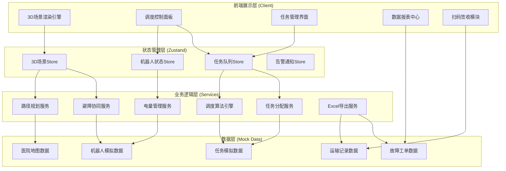
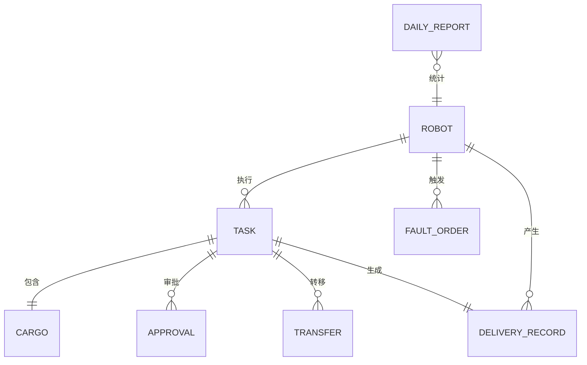

# 医院智能物流机器人调度平台 - 技术架构文档

## 1. 架构设计



## 2. 技术说明

### 2.1 核心技术栈
- **前端框架**: React@18.2 + TypeScript@5.3 + Vite@5.0
- **3D渲染引擎**: three@0.160 + @react-three/fiber@8.15 + @react-three/drei@9.92 + @react-three/postprocessing@2.15
- **状态管理**: zustand@4.4
- **样式方案**: tailwindcss@3.4 + postcss@8.4
- **路由管理**: react-router-dom@6.21
- **图表可视化**: recharts@2.10
- **图标库**: lucide-react@0.294
- **Excel导出**: xlsx@0.18.5
- **日期处理**: dayjs@1.11

### 2.2 初始化方式
- 使用 `npm init vite-init@latest -y . -- --template react-ts --force` 创建React+TypeScript项目骨架
- 后续手动安装 three.js 相关3D渲染依赖、recharts图表库、xlsx导出库等业务依赖

### 2.3 数据方案
- **数据源**: 全部采用前端Mock数据模拟，不搭建后端服务
- **模拟方式**: 使用TypeScript工厂函数生成真实感模拟数据，包含机器人位置轨迹、任务生命周期、电量消耗曲线等
- **数据持久化**: localStorage存储报表导出配置、用户偏好设置

## 3. 路由定义
| 路由路径 | 页面组件 | 功能说明 |
|----------|----------|----------|
| `/` | Dashboard | 3D调度总览主界面(默认首页) |
| `/robots` | RobotList | 机器人列表管理页 |
| `/robots/:id` | RobotDetail | 机器人详情+轨迹回放页 |
| `/tasks` | TaskCenter | 任务调度中心页 |
| `/tasks/create` | TaskCreate | 新建任务页 |
| `/scan` | ScanConfirm | 扫码签收确认页 |
| `/faults` | FaultCenter | 故障告警与工单中心 |
| `/reports` | ReportCenter | 数据报表与导出中心 |
| `/reports/export` | ReportExport | 报表导出配置页 |

## 4. API定义(前端模拟)

### 4.1 类型定义
```typescript
// 机器人状态
interface Robot {
  id: string;
  code: string;
  model: string;
  battery: number;
  status: 'idle' | 'working' | 'charging' | 'fault' | 'returning';
  position: { x: number; y: number; z: number; area: AreaType };
  currentTaskId: string | null;
  cargo: Cargo | null;
  totalMileage: number;
  totalDeliveries: number;
  deployDate: string;
}

// 任务类型
interface Task {
  id: string;
  code: string;
  type: 'emergency_lab' | 'regular_med' | 'narcotic' | 'supply' | 'sample';
  priority: 1 | 2 | 3;
  status: 'pending' | 'assigned' | 'picking' | 'delivering' | 'arrived' | 'confirmed' | 'timeout' | 'cancelled' | 'transferred';
  origin: AreaType;
  destination: AreaType;
  cargo: Cargo;
  assignedRobotId: string | null;
  createTime: string;
  dueTime: string;
  confirmTime: string | null;
  signer: string | null;
  approvals: ApprovalRecord[];
  transferHistory: TransferRecord[];
}

// 位置区域
type AreaType = 'pharmacy' | 'lab' | 'operating_room' | 'nurse_station' | 'supply_room' | 'charging_station' | 'corridor';

// 货物信息
interface Cargo {
  barcode: string;
  type: string;
  name: string;
  weight: number;
  isNarcotic: boolean;
  narcoticLevel?: 'I' | 'II' | 'III';
}

// 审批记录
interface ApprovalRecord {
  level: 1 | 2 | 3;
  approverRole: string;
  approverName: string;
  time: string;
  verified: boolean;
}

// 转移记录
interface TransferRecord {
  fromRobotId: string;
  toRobotId: string;
  reason: 'low_battery' | 'fault';
  time: string;
}

// 运输记录
interface DeliveryRecord {
  id: string;
  taskId: string;
  robotId: string;
  route: { x: number; y: number; timestamp: string }[];
  startTime: string;
  endTime: string;
  onTime: boolean;
}

// 故障工单
interface FaultOrder {
  id: string;
  robotId: string;
  faultCode: string;
  faultLevel: 'critical' | 'major' | 'minor';
  description: string;
  status: 'pending' | 'assigned' | 'repairing' | 'resolved';
  assignedEngineer: string | null;
  createTime: string;
  resolveTime: string | null;
  position: { x: number; y: number; area: AreaType };
}

// 日报数据
interface DailyReport {
  date: string;
  robots: {
    robotCode: string;
    deliveryCount: number;
    onTimeRate: number;
    avgDeliveryTime: number;
    batteryConsumption: number;
    chargeCount: number;
    faultCount: number;
  }[];
  totalDeliveries: number;
  overallOnTimeRate: number;
  faultDistribution: { type: string; count: number }[];
  peakHours: { hour: number; count: number }[];
}
```

## 5. 核心算法模块

### 5.1 任务分配算法
```
输入: 待分配任务、可用机器人列表
输出: 最优匹配机器人ID
算法步骤:
1. 过滤条件: 电量≥20%、状态=idle、任务可承载
2. 计算评分 Score = w1*距离分 + w2*电量分 + w3*负载分
   - 距离分: 1 - (当前距离/最大距离)，使用曼哈顿距离
   - 电量分: 当前电量/100，优先高电量
   - 负载分: 1 - (当前载重/最大载重)
3. 若任务优先级=急诊，额外加分0.2
4. 返回Score最高的机器人，同分取编号较小者
```

### 5.2 多机避障策略
```
触发条件: 两机器人距离阈值<3米
处理逻辑:
1. 比较优先级: 急诊任务>毒麻运输>常规任务>空车>充电中
2. 低优先级机器人执行:
   a. 若侧边空间≥2米: 绕行(生成临时偏移路径)
   b. 若侧边空间不足: 就近停靠点等待，显示倒计时
3. 电梯口交汇: 先到先得原则，同乘重量≤500kg时可同乘
4. 避障期间两机器人均显示避让状态
```

## 6. 数据模型(Mock)

### 6.1 实体关系图


### 6.2 初始模拟数据说明
- **机器人**: 8台，RB001-RB008，分布于各区域待命
- **任务**: 实时生成15-20个不同状态任务，覆盖全部5种类型
- **路径节点**: 预定义6个区域间的拓扑路径，含走廊和电梯节点
- **历史记录**: 近7天模拟运输记录、故障记录用于报表展示
- **工程师**: 3名维修工程师模拟值班状态

## 7. 前端目录结构
```
src/
├── assets/                 # 静态资源
├── components/             # 可复用组件
│   ├── three3d/           # 3D场景相关组件
│   │   ├── HospitalScene.tsx
│   │   ├── RobotModel.tsx
│   │   ├── PathLine.tsx
│   │   ├── AreaZone.tsx
│   │   └── CameraController.tsx
│   ├── layout/            # 布局组件
│   │   ├── Header.tsx
│   │   ├── Sidebar.tsx
│   │   └── StatusBar.tsx
│   ├── ui/                # 基础UI组件
│   │   ├── DataCard.tsx
│   │   ├── StatusBadge.tsx
│   │   ├── ProgressRing.tsx
│   │   ├── Timeline.tsx
│   │   └── Modal.tsx
│   ├── robot/             # 机器人相关组件
│   ├── task/              # 任务相关组件
│   ├── fault/             # 故障相关组件
│   └── report/            # 报表相关组件
├── hooks/                  # 自定义hooks
│   ├── useRobotSimulation.ts
│   ├── useTaskScheduler.ts
│   ├── usePathAnimation.ts
│   └── useBatteryMonitor.ts
├── pages/                  # 页面组件
│   ├── Dashboard.tsx
│   ├── RobotList.tsx
│   ├── RobotDetail.tsx
│   ├── TaskCenter.tsx
│   ├── TaskCreate.tsx
│   ├── ScanConfirm.tsx
│   ├── FaultCenter.tsx
│   ├── ReportCenter.tsx
│   └── ReportExport.tsx
├── store/                  # Zustand状态管理
│   ├── robotStore.ts
│   ├── taskStore.ts
│   ├── sceneStore.ts
│   └── alertStore.ts
├── services/               # 业务逻辑服务
│   ├── scheduler.ts
│   ├── pathfinding.ts
│   ├── collision.ts
│   └── excelExport.ts
├── types/                  # TypeScript类型定义
│   └── index.ts
├── utils/                  # 工具函数
│   ├── mock.ts
│   ├── format.ts
│   └── constants.ts
├── App.tsx
├── main.tsx
└── index.css
```
